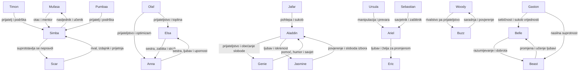

# Seminar: Veze likova u Disney svijetu

## Sadržaj

1. [Uvod](#uvod)
2. [Disney kao svijet povezanih priča](#disney-kao-svijet-povezanih-priča)
3. [Vrste veza među Disney likovima](#vrste-veza-među-disney-likovima)
4. [Porodične veze](#porodične-veze)
5. [Prijateljstvo kao pokretač radnje](#prijateljstvo-kao-pokretač-radnje)
6. [Ljubavne veze i lična promjena](#ljubavne-veze-i-lična-promjena)
7. [Sukobi između junaka i negativaca](#sukobi-između-junaka-i-negativaca)
8. [Mentori i vodiči](#mentori-i-vodiči)
9. [Mreža odnosa](#mreža-odnosa)
10. [Zaključak](#zaključak)

## Uvod

Disney filmovi već decenijama zauzimaju posebno mjesto u popularnoj kulturi. Njihove priče gledaju djeca, mladi i odrasli, a likovi poput Simbe, Else, Anne, Ariela, Belle, Aladdina, Woodyja i mnogih drugih postali su prepoznatljivi širom svijeta. Iako se Disney filmovi često pamte po pjesmama, animaciji, humoru i bajkovitoj atmosferi, njihova prava snaga nalazi se u odnosima među likovima.

Tema ovog seminara su **veze likova u Disney svijetu**, odnosno način na koji su likovi povezani, zašto su te veze važne i kako utiču na razvoj radnje. Disney likovi rijetko djeluju potpuno sami. Njihove odluke, strahovi, snovi i promjene najčešće nastaju kroz odnose s drugim likovima. Nekada ih pokreće ljubav prema porodici, nekada prijateljstvo, nekada želja za slobodom, a nekada sukob s likom koji predstavlja prepreku.

Cilj seminara je pokazati da veze među Disney likovima nisu samo ukras priče, nego njen temelj. Kroz odnose se grade glavne poruke filmova: važnost porodice, snaga prijateljstva, hrabrost, odgovornost, prihvatanje različitosti, opasnost sebičnosti i značaj iskrenosti. Kada posmatramo odnose među likovima, bolje razumijemo zašto se oni ponašaju na određeni način i šta ih vodi kroz priču.

U ovom radu biće analizirane različite vrste veza: porodične, prijateljske, ljubavne, sukobljene i mentorske. Posebna pažnja biće posvećena primjerima iz poznatih Disney filmova kao što su *The Lion King*, *Frozen*, *Aladdin*, *The Little Mermaid*, *Beauty and the Beast* i *Toy Story*. Na kraju će biti prikazana i mreža odnosa kroz dijagram koji pokazuje kako se likovi povezuju i kakvu ulogu imaju jedni prema drugima.

## Disney kao svijet povezanih priča

Disney filmovi često imaju jednostavnu osnovu: glavni lik ima želju ili problem, susreće prepreke, uči važnu lekciju i na kraju se mijenja. Međutim, ono što te priče čini emocionalno snažnim jeste činjenica da se promjena glavnog lika dešava kroz odnose. Lik se ne razvija samo zato što prolazi kroz avanturu, nego zato što u toj avanturi upoznaje druge, gubi nekoga, bori se za nekoga ili shvata vrijednost veze koju je ranije zanemarivao.

Na primjer, Simba iz *The Lion King* ne postaje kralj samo zato što je rođen kao nasljednik. On mora razumjeti šta znači odgovornost, a to uči kroz odnos s Mufasom, sukob sa Scarom i prijateljstvo s Timonom i Pumbaom. Elsa iz *Frozen* ne pobjeđuje svoj strah sama, nego kroz ljubav i upornost svoje sestre Anne. Aladdin ne postaje bolja osoba samo kroz čarobne želje, nego kroz prijateljstvo s Geniejem i iskren odnos s Jasmine.

Disney svijet je zato moguće posmatrati kao mrežu odnosa. Svaki lik ima svoju funkciju u priči. Neki likovi pružaju podršku, neki iskušavaju glavnog junaka, neki ga uče, a neki ga navode na pogrešne odluke. Upravo kroz te veze publika razumije moralnu poruku filma.

## Vrste veza među Disney likovima

Disney filmovi prikazuju različite oblike odnosa. Najčešći su porodični odnosi, prijateljstva, ljubavne veze, sukobi i mentorski odnosi. Svaka od ovih veza ima posebnu ulogu u razvoju priče.

| Tip veze | Primjeri | Zašto su likovi povezani | Kako veza utiče na priču |
|---|---|---|---|
| Porodična veza | Simba i Mufasa, Elsa i Anna | Dijele porijeklo, ljubav, odgovornost i emocije | Pokreće teme odrastanja, zaštite, gubitka i oprosta |
| Prijateljstvo | Aladdin i Genie, Woody i Buzz | Pomažu jedno drugome i uče kroz zajedničke izazove | Donosi humor, podršku i razvoj karaktera |
| Ljubavna veza | Belle i Beast, Ariel i Eric | Povezani su emocijama, razumijevanjem ili željom za slobodom | Vodi likove prema hrabrosti, promjeni i zrelosti |
| Sukob | Scar i Simba, Ursula i Ariel, Jafar i Aladdin | Imaju suprotne ciljeve i vrijednosti | Stvara glavnu prepreku i napetost u radnji |
| Mentorstvo | Mufasa i Simba, Merlin i Arthur, Sebastian i Ariel | Iskusniji lik vodi, savjetuje ili upozorava mlađeg | Prenosi lekciju o odgovornosti, identitetu i mudrosti |

Ove veze se često prepliću. Jedan odnos može istovremeno biti porodičan i mentorski, kao odnos Mufase i Simbe. Drugi odnos može početi kao sukob, a završiti kao razumijevanje, kao kod Belle i Beast. Zbog toga su Disney priče zanimljive: odnosi nisu uvijek jednostavni, nego se mijenjaju kako se mijenjaju likovi.

## Porodične veze

Porodica je jedna od najvažnijih tema u Disney filmovima. Porodične veze često objašnjavaju ko je lik, odakle dolazi i kakvu odgovornost nosi. One mogu biti izvor ljubavi i sigurnosti, ali i straha, tuge ili pritiska.

### Simba i Mufasa

Jedan od najpoznatijih porodičnih odnosa u Disney svijetu je odnos Simbe i Mufase u filmu *The Lion King*. Mufasa nije samo Simbin otac, nego i njegov učitelj. On Simbi objašnjava ravnotežu života, odgovornost kralja i značaj poštovanja prema svim bićima. Kroz taj odnos Simba uči da biti vođa ne znači samo imati moć, nego štititi druge.

Mufasina smrt predstavlja prelomni trenutak u filmu. Simba osjeća krivicu i bježi od svoje prošlosti. Ipak, veza s ocem ne nestaje. Mufasine riječi i sjećanje na njega kasnije pomažu Simbi da shvati ko je i da se vrati na Pride Rock. Ovaj odnos pokazuje da porodična veza može ostati snažna čak i nakon gubitka.

### Elsa i Anna

U filmu *Frozen*, odnos Else i Anne prikazuje sestrinsku ljubav koja prolazi kroz strah, udaljenost i ponovno povezivanje. Elsa se udaljava od Anne jer se boji da će je povrijediti svojim moćima. Ona misli da izolacijom štiti sestru, ali upravo ta izolacija stvara bol i nerazumijevanje.

Anna, za razliku od Else, vjeruje u bliskost i ne odustaje od sestre. Njena upornost pokazuje da prava porodična ljubav ne znači savršen odnos, nego spremnost da se drugi razumije i prihvati. Na kraju, ljubav između sestara postaje ključ za rješenje problema. Film time šalje poruku da porodica može biti izvor snage, posebno onda kada likovi nauče otvoreno govoriti o strahu i emocijama.

### Porodica kao motivacija

U Disney filmovima porodica često motiviše glavnog lika. Likovi žele zaštititi svoje najbliže, pronaći svoje porijeklo ili popraviti narušene odnose. Porodična veza daje radnji emocionalnu dubinu jer publika lako razumije osjećaje poput ljubavi, gubitka, krivice i oprosta.

## Prijateljstvo kao pokretač radnje

Prijateljstvo je još jedna ključna veza u Disney pričama. Prijatelji često pomažu glavnom liku da prebrodi prepreke, ali ga i upozoravaju kada griješi. U mnogim filmovima prijateljstvo donosi humor, toplinu i ravnotežu ozbiljnim temama.

### Aladdin i Genie

Odnos Aladdina i Genieja počinje kao odnos između vlasnika lampe i duha koji ispunjava želje. Ipak, vrlo brzo se razvija u iskreno prijateljstvo. Genie ima moć da pomogne Aladdinu, ali istovremeno ima i vlastitu želju: želi biti slobodan. Zbog toga njihov odnos nije jednostran. Aladdin dobija pomoć, ali i uči da prava vrijednost čovjeka ne dolazi iz bogatstva ili lažnog identiteta.

Genie je važan jer Aladdinu pokazuje da se ne mora pretvarati da je princ kako bi bio vrijedan ljubavi. Njihovo prijateljstvo uči Aladdina iskrenosti, a Aladdin na kraju oslobađa Genieja, čime pokazuje da je naučio misliti i na druge. Ovaj odnos je primjer prijateljstva koje se temelji na povjerenju, podršci i slobodi.

### Woody i Buzz

U filmu *Toy Story*, Woody i Buzz na početku nisu prijatelji. Woody se osjeća ugroženo jer Buzz postaje nova omiljena igračka. Njihov odnos počinje ljubomorom i rivalstvom, ali se kroz zajedničku opasnost pretvara u prijateljstvo. Oni uče da ne moraju biti neprijatelji i da svako ima svoju vrijednost.

Ovaj odnos pokazuje da prijateljstvo ne mora nastati odmah. Ponekad se razvija kroz sukob, nesporazume i zajedničko iskustvo. Woody i Buzz postaju snažniji zajedno nego što su bili odvojeno.

### Uloga sporednih prijatelja

Likovi poput Timona, Pumbae, Olafa, Sebastiana i Mushua često imaju ulogu prijatelja pomagača. Oni donose humor, ali i važne savjete. Njihova funkcija nije samo da nasmiju publiku, nego da glavnom liku pomognu da sagleda problem iz drugog ugla.

## Ljubavne veze i lična promjena

Ljubav u Disney filmovima često nije prikazana samo kao romantičan cilj, nego kao proces promjene. Kroz ljubavne odnose likovi uče da budu hrabriji, iskreniji i bolji prema drugima.

### Belle i Beast

U filmu *Beauty and the Beast*, odnos Belle i Beast počinje strahom i nerazumijevanjem. Beast je grub, zatvoren i ljut, dok Belle želi slobodu i poštovanje. Njihov odnos se razvija postepeno. Belle počinje uviđati da Beast nije samo čudovište, nego biće koje pati i koje se može promijeniti. Beast, s druge strane, kroz Belle uči strpljenje, nježnost i nesebičnost.

Ova veza pokazuje da prava ljubav nije zasnovana na izgledu, nego na karakteru i postupcima. Beast se ne mijenja zato što želi izgledati drugačije, nego zato što uči voljeti i poštovati drugu osobu.

### Ariel i Eric

U filmu *The Little Mermaid*, Arielina veza s Ericom povezana je s njenom željom za drugačijim životom. Eric za Ariel predstavlja svijet iznad mora, slobodu i mogućnost izbora. Ipak, ova veza također pokazuje opasnost brzih odluka. Ariel sklapa dogovor s Ursulom jer želi ostvariti svoj san, ali ne razumije potpuno posljedice.

Kroz ovaj odnos Disney prikazuje i hrabrost i rizik. Ariel je spremna napustiti poznati svijet, ali mora naučiti da se želje ne smiju ostvarivati po svaku cijenu.

## Sukobi između junaka i negativaca

Sukob je neophodan dio Disney priča. Negativci nisu samo prepreka, nego često predstavljaju suprotnu vrijednost od glavnog junaka. Kroz sukob se jasnije vidi šta junak brani i za šta se bori.

### Scar i Simba

Scar i Simba su povezani porodično, ali njihov odnos je obilježen izdajom i borbom za vlast. Scar želi moć bez odgovornosti, dok Simba mora naučiti da prava vlast znači služenje zajednici. Scar koristi manipulaciju, laž i strah, dok Simba na kraju bira istinu, hrabrost i povratak odgovornosti.

Ovaj sukob je važan jer pokazuje razliku između sebične ambicije i pravednog vođstva. Scar nije samo negativac zato što želi biti kralj, nego zato što ne mari za posljedice svojih postupaka.

### Ursula i Ariel

Ursula je povezana s Ariel kroz manipulaciju. Ona koristi Arielinu želju da postane čovjek i pretvara je u sredstvo za vlastiti plan. Ursula zna šta Ariel želi i koristi njenu ranjivost. Ovaj odnos pokazuje da negativci često ne pobjeđuju silom odmah, nego obećanjima, prevarom i iskorištavanjem tuđih slabosti.

### Jafar i Aladdin

Jafar i Aladdin imaju suprotne ciljeve. Aladdin želi bolji život i ljubav, dok Jafar želi potpunu moć. Njihov sukob pokazuje razliku između želje za dostojanstvom i želje za dominacijom. Aladdin griješi kada se pretvara da je princ, ali ipak ima sposobnost da se promijeni. Jafar, nasuprot tome, sve više tone u pohlepu.

## Mentori i vodiči

Mentori su likovi koji pomažu glavnim junacima da razumiju sebe i svijet oko sebe. Oni ne rješavaju problem umjesto glavnog lika, nego ga usmjeravaju.

### Mufasa kao mentor

Mufasa je najjasniji primjer mentora jer Simbi prenosi znanje o krugu života i odgovornosti. Njegova uloga se nastavlja i nakon smrti, jer Simba u ključnom trenutku čuje njegovu poruku: mora se sjetiti ko je. Mentorstvo ovdje nije samo davanje savjeta, nego oblikovanje identiteta glavnog lika.

### Sebastian kao savjetnik

Sebastian u *The Little Mermaid* pokušava zaštititi Ariel i podsjetiti je na opasnosti svijeta ljudi. Iako je često komičan lik, njegova uloga je važna jer predstavlja glas razuma. On ne može zaustaviti Ariel, ali joj pomaže u najvažnijim trenucima.

### Genie kao prijatelj i mentor

Genie je istovremeno prijatelj i mentor. On Aladdinu ispunjava želje, ali ga i upozorava da laž ne može trajati vječno. Njegova posebnost je u tome što i sam ima svoj san, pa odnos s Aladdinom postaje obostrano važan.

## Mreža odnosa

Sljedeći dijagram prikazuje pojednostavljenu mrežu odnosa među poznatim Disney likovima. Strelice pokazuju vrstu veze i funkciju koju jedan lik ima prema drugom.

## Šta ove veze govore o Disney porukama?

Kada se uporede navedeni primjeri, jasno je da Disney odnose koristi kako bi prikazao univerzalne životne lekcije. Porodične veze uče o odgovornosti i ljubavi. Prijateljstva pokazuju da se ljudi, odnosno likovi, lakše mijenjaju kada imaju podršku. Ljubavne veze često naglašavaju iskrenost, prihvatanje i unutrašnju ljepotu. Sukobi prikazuju razliku između dobra i zla, ali i posljedice sebičnosti, pohlepe i manipulacije.

Važno je naglasiti da Disney likovi nisu povezani slučajno. Svaka veza ima svoju funkciju. Ako se ukloni Mufasa, Simba nema moralni uzor. Ako se ukloni Anna, Elsa ostaje zarobljena u strahu. Ako se ukloni Genie, Aladdin ne bi naučio koliko su sloboda i iskrenost važni. Ako se ukloni Ursula, Ariel ne bi imala prepreku koja pokazuje opasnost nepromišljenih odluka.

Zato se može zaključiti da su odnosi među likovima glavni mehanizam Disney pripovijedanja. Kroz njih publika ne prati samo šta se dogodilo, nego i zašto se dogodilo i kako je to promijenilo likove.

## Zaključak

Veze među Disney likovima predstavljaju osnovu njihovih priča. One objašnjavaju motive, pokreću radnju i omogućavaju razvoj karaktera. Bez odnosa s drugim likovima, Disney junaci ne bi imali istu emocionalnu dubinu niti bi njihove priče ostavile tako snažan utisak na publiku.

Porodične veze, poput odnosa Simbe i Mufase ili Else i Anne, prikazuju ljubav, zaštitu, gubitak i odgovornost. Prijateljstva, kao što su Aladdin i Genie ili Woody i Buzz, pokazuju da se povjerenje gradi kroz zajedničke izazove. Ljubavne veze, poput Belle i Beast ili Ariel i Eric, često vode likove prema promjeni i boljem razumijevanju sebe. Sukobi s negativcima, poput Scara, Ursule i Jafara, otkrivaju moralne vrijednosti glavnih junaka i stvaraju glavnu napetost u priči. Mentori i vodiči pomažu likovima da pronađu pravi put, ali odluka uvijek ostaje na glavnom junaku.

Disney filmovi zbog toga nisu samo bajke o princezama, kraljevima, čaroliji i avanturama. Oni su priče o odnosima. Njihova trajna popularnost proizlazi iz toga što publika u tim odnosima prepoznaje stvarne emocije: ljubav prema porodici, potrebu za prijateljstvom, strah od odbacivanja, želju za slobodom i borbu između sebičnosti i dobrote.

Na kraju, može se reći da su Disney likovi povezani zato što upravo kroz povezanost nastaje značenje priče. Likovi se mijenjaju jer vole, griješe, opraštaju, pomažu, gube i ponovo pronalaze jedni druge. Zbog toga Disney priče ostaju razumljive i emotivne različitim generacijama.
